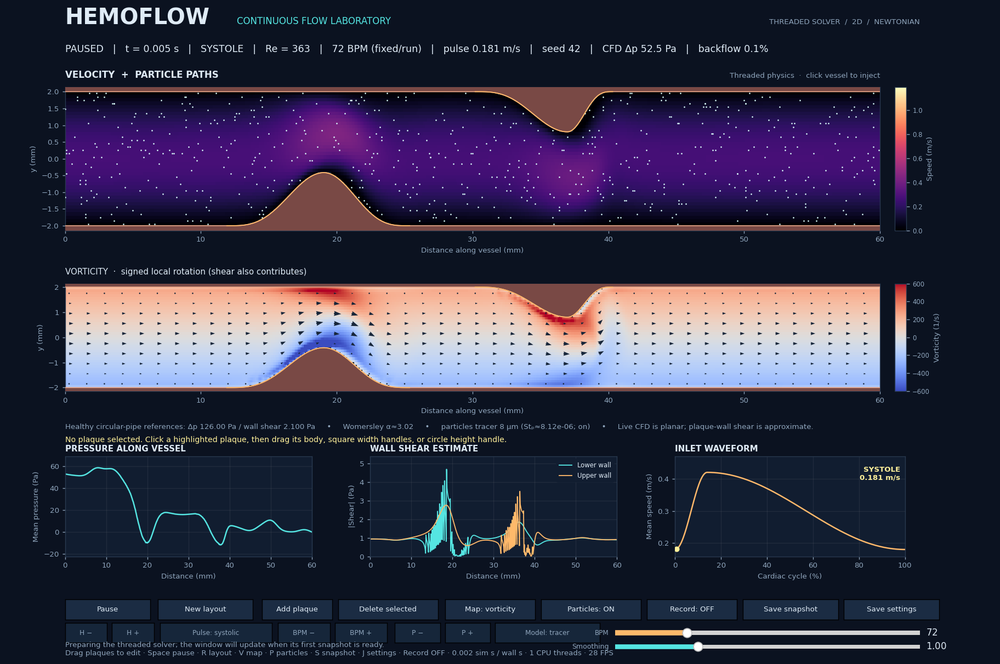

# HemoFlow

**Interactive flow simulation and numerical verification of stenosed planar channels.**

HemoFlow combines a Python lattice Boltzmann solver, an interactive geometry
editor, and reproducible experiments on pulsatile flow. The project investigates
how outlet treatment, downstream domain length, startup conditions, and grid
resolution affect pressure, flow, and wall-shear measurements.

Developed by **Diego Lerdahl, Rice University**.



*Illustrative viewer screenshot; not a verification result.*

## Current status

Healthy-channel benchmarks and selected severe-case cycle-settling and
downstream-length comparisons have passed their declared checks. The completed
N80 comparison between 120 mm and 150 mm domains supports agreement of the
recorded observables in the monitored region under the tested conditions.

**Grid independence, timestep independence, and independent physical validation
remain unestablished.** The controlled N80/N120/N160 study is implemented;
completed grid-refinement results are not included in this evidence set.

Documentation updated October 5, 2026, using scientific summaries through
September 28 and software checks from September 29. No new long simulation
was run for this documentation update.

## Engineering work

- Built a threaded flow viewer with editable plaques, pulsatile inputs, heatmaps,
  particle probes, and headless recording.
- Compared outlet implementations against healthy prerequisites before severe
  stenosis pilots; retained failed checks as part of the development record.
- Added pressure, density, and flow probes at fixed physical locations, signed
  wall-shear profiles, and phase-matched velocity fields to isolate numerical effects.
- Developed cycle-repeatability and domain-comparison criteria, with separate
  checks for pressure, flow, mean/peak shear, and downstream shear profiles.
- Preserved source hashes, realized geometry, timestep, thread count, settings,
  and recording times for reproducible experiments and case-boundary resume.

## Completed tests and findings

| Test | Recorded result | Interpretation |
| --- | --- | --- |
| Earlier outlet candidate, healthy steady/pulsatile regression | Steady cases passed; candidate pulsatile cases failed at both tested timesteps | Severe pilots were blocked by the healthy prerequisite checks |
| Section-impedance outlet revision | All six required healthy cases and healthy pair comparisons passed | Revision was eligible for short severe pilots |
| Early D75 severe pilots | Cycle-repeatability errors were 60.03% for the baseline and 53.76% for the revision, against a 1% criterion | Outlet revision alone did not resolve severe-case repeatability |
| Wall-gradient audit | 128/128 analytical measurement tests passed; ten recorded cases processed without audit errors | Verified measurement calculations; did not establish stenosis WSS accuracy or solver convergence |
| Ten-cycle settling at N80, 90/120 mm | Worst final-three-transition changes: 3.176% at 90 mm; 0.133% at 120 mm | 90 mm failed the 1% repeatability criterion; 120 mm passed |
| N80 domain comparison, 90/120 mm | Far-downstream signed-WSS differences were 12.88–12.98% over cycles 8–10 | Failed the 10% domain criterion despite much closer pressure and flow agreement |
| Ten-cycle confirmation at N80, 120/150 mm | Both repeatability checks and the final-three-cycle domain screen passed | Supports the longer-domain setup for further grid/timestep investigation |
| Software regression suite | 35 tests passed: 23 desktop, 4 length-study, 8 grid-study | Software checks; separate from physical validation |

The section-impedance revision is an experimental research outlet. The desktop
viewer still defaults to regularized stress extrapolation, with Zou–He available
as a baseline. These implementations are documented separately; research results
do not automatically verify the desktop outlet.

## Quantitative benchmark and latest comparison

The healthy N80/L150 steady run was assessed over 1.75–2.00 s against planar
Poiseuille references. Pressure difference is measured between x = 20 and 50 mm.

| Quantity | Computed | Analytical reference | Absolute relative error |
| --- | ---: | ---: | ---: |
| Pressure difference | 23.6455 Pa | 23.6250 Pa | 0.0866% |
| Mean absolute WSS | 1.55596 Pa | 1.57500 Pa | 1.2090% |
| Flow per unit depth | 0.0012000672 m²/s | 0.0012000000 m²/s | 0.00560% |

The severe length-confirmation runs used a symmetric **75% planar-gap
reduction**, N80, Δt = 0.300 µs, 72 BPM, and ten cycles. The following are the
largest differences over cycles 8–10, using the 120 mm case as reference:

| Comparison, 120 vs 150 mm | Observed maximum | Declared limit |
| --- | ---: | ---: |
| Mean pressure difference | 0.0220% | 2% |
| Pressure-waveform relative L2 | 0.1221% | 5% |
| Mean absolute WSS difference | 0.1113% | 5% |
| Mean-WSS waveform relative L2 | 0.1824% | 5% |
| Peak-WSS waveform relative L2 | 0.00929% | 10% |
| Flow-waveform relative L2 | 0.00691% | 2% |
| Signed WSS, x = 20–55 mm, space-time L2 | 0.6462% | 10% |
| Signed WSS, x = 50–55 mm, space-time L2 | 2.9844% | 10% |

Worst adjacent-cycle changes were **0.1325% at 120 mm** and **0.0393% at
150 mm**, both below the 1% criterion. These results apply to the recorded
quantities, specified regions, grid, forcing, and observation window. They
do not demonstrate convergence everywhere in the domain.

Exact values, source summaries, and additional criteria are linked in
[the results record](HemoFlow/docs/results.md).

## Model and limitations

The solver is two-dimensional, planar, rigid-walled, Newtonian, and weakly
compressible. Typical inputs are a 4 mm gap, density 1060 kg/m³, viscosity
0.0035 Pa·s, and nominal mean inlet speed 0.30 m/s. Heart rate is fixed during a
run; the illustrative systolic waveform modulates velocity rather than BPM.

Stenosis is measured as gap reduction, with requested and realized raster
values recorded separately. A 50% linear reduction has a 75% circular-area
equivalent, but the solver does not resolve a circular 3D artery. Circular-pipe
pressure/WSS references are not the acceptance targets for the planar solver.

Particles are tracers or dilute one-way inertial probes. They do not resolve
red-cell deformation, hematocrit, platelet adhesion, aggregation, or thrombosis.
Clinical prediction and patient-specific validation are outside the demonstrated scope.

## Run the application

Python 3.12 or 3.13 is recommended. From the repository root in PowerShell:

```powershell
Set-Location HemoFlow
python -m venv .venv
.\.venv\Scripts\python.exe -m pip install -r requirements.txt
.\.venv\Scripts\python.exe main.py --defaults --cells 80 --fps 45
```

Alternatively, run `HemoFlow/START_HemoFlow.bat`. Display FPS is a rendering
target, not a guarantee of simulation speed or numerical accuracy.

From the application folder, run desktop tests:

```powershell
.\.venv\Scripts\python.exe -m unittest discover -s tests -v
```

Inspect the grid plan without starting a long batch:

```powershell
.\.venv\Scripts\python.exe studies\grid_refinement\run_grid.py --plan-only
```

The N160 stage is conditional and can require multiple days. Its full scientific
results must be assessed before claiming grid independence.

## Repository contents

| Location | Contents |
| --- | --- |
| [HemoFlow](HemoFlow/README.md) | Viewer, solver, logging, and launchers |
| [Model](HemoFlow/docs/model.md) | Assumptions, boundaries, units, and particle scope |
| [Results](HemoFlow/docs/results.md) | Test history, numerical results, and evidence links |
| [Evidence](HemoFlow/docs/evidence/README.md) | Selected run summaries and provenance |
| [Studies](HemoFlow/studies/README.md) | Length confirmation and controlled grid comparison |
| [Verification](HemoFlow/docs/verification.md) | Acceptance scope and remaining work |

Raw experiment directories, environments, and generated caches are excluded.
Selected summary evidence is versioned here; full recordings and phase fields
are retained separately. Frozen study source must remain unchanged for an
existing run to pass its resume identity checks.

## Next steps

1. Assess the controlled grid comparisons with the same physical geometry,
   forcing, probe locations, and numerical wave speed.
2. Complete a separate timestep-sensitivity assessment with admissible
   relaxation parameters.
3. Quantify remaining wall-shear and velocity-field sensitivity before a broad
   severity study.
4. Compare against an independent physical benchmark, then extend particle
   physics with corresponding verification tests.
